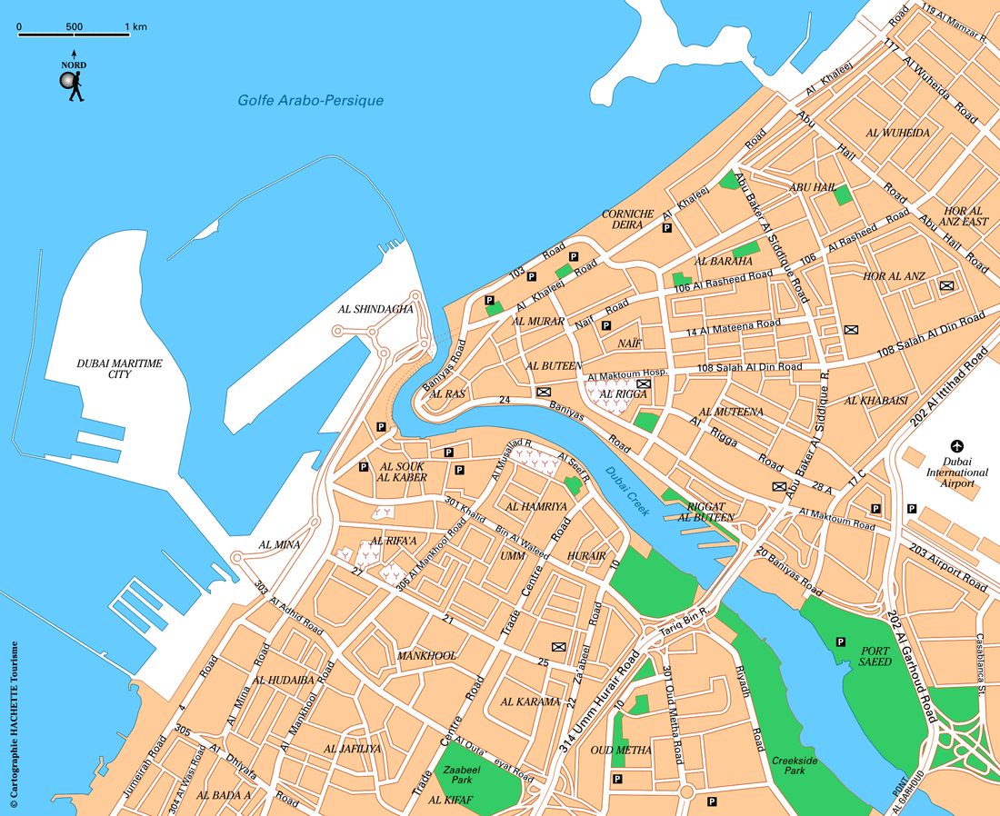
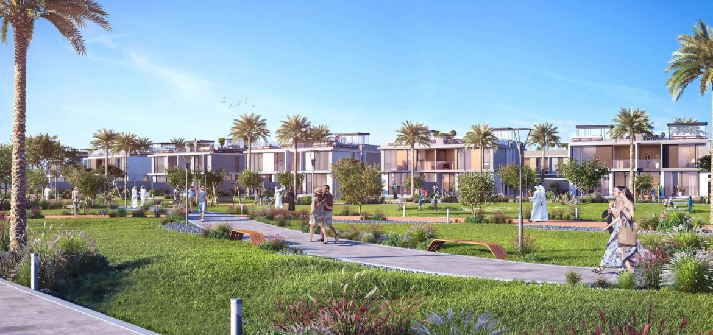

# <html lang="fr">
	<head>
		<meta charset="utf-8"/> 
		<link rel="stylesheet" href="style.css">
	</head>
	<body>
	<title> Dubaï </title>

	<h1> Modernité, Tranquilité et Opportunité : Dubaï vous attends ! </h1>
	
 Bienvenue à <strong> Dubaï</strong>, la perle du désert où modernité et tradition se rencontrent. Ce site a pour objectif de vous offrir quelques clichés extraordinaires de cette belle ville qui vous montrent les differents cotés de <strong>Dubaï</strong> ! Entre gratte-ciels futuristes, plages dorées et quartiers residentiels tranquilles,découvrez une ville unique au monde, symbole de rêve et d’opportunité.

	
	
	
	
	
	
	
 Afin d'en apprendre d'avantage sur cette magnifique ville et découvrir tout ce que Dubaï a à vous offrir, je vous laisse feuilleter la brochure jusqu'au bout. 

		
</body>
</html>
